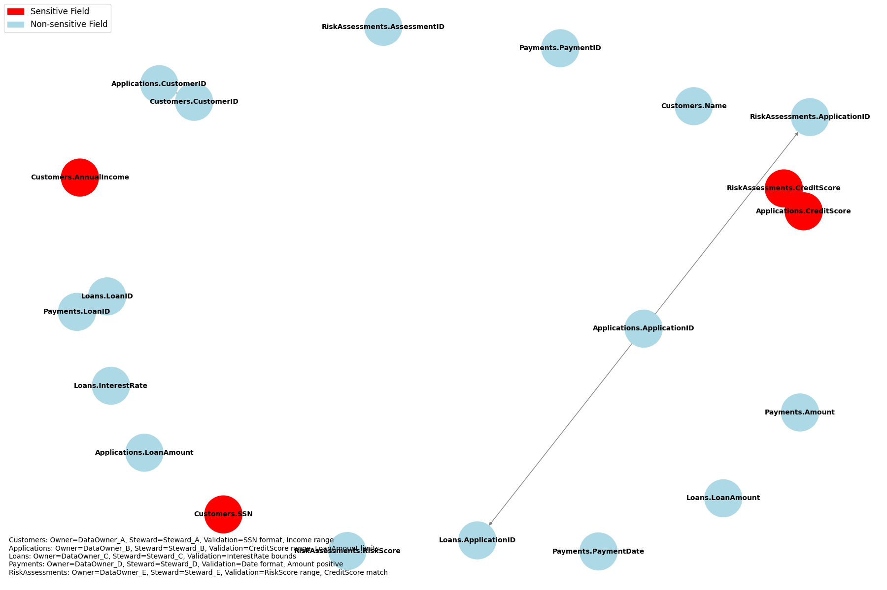

# 🛡️ Data Governance Diagram for Mortgage Lending Schema

This document provides a visual representation of data governance across the mortgage lending and servicing system. It highlights sensitive fields, ownership, stewardship, and validation rules to support compliance, data quality, and transparency.

---

## 📘 Purpose

The Data Governance Diagram helps:
- Identify and protect sensitive data
- Assign clear ownership and stewardship
- Enforce validation rules for data integrity
- Support regulatory audits and internal controls

---

## 🖼️ Diagram Overview

  

### 🔹 Legend
- 🔴 **Sensitive Fields**: SSN, CreditScore, AnnualIncome
- 🔵 **Non-sensitive Fields**: All other attributes

---

## 🧭 Governance Metadata

| Table            | Data Owner     | Data Steward   | Validation Rules                          |
|------------------|----------------|----------------|-------------------------------------------|
| `Customers`      | DataOwner_A    | Steward_A      | SSN format, Income range                  |
| `Applications`   | DataOwner_B    | Steward_B      | CreditScore range, LoanAmount limits      |
| `Loans`          | DataOwner_C    | Steward_C      | InterestRate bounds                       |
| `Payments`       | DataOwner_D    | Steward_D      | Date format, Amount positive              |
| `RiskAssessments`| DataOwner_E    | Steward_E      | RiskScore range, CreditScore match        |

---

## 🔗 Relationships Tracked

- `Customers.CustomerID` → `Applications.CustomerID`
- `Applications.ApplicationID` → `Loans.ApplicationID`
- `Loans.LoanID` → `Payments.LoanID`
- `Applications.ApplicationID` → `RiskAssessments.ApplicationID`
- `Applications.CreditScore` → `RiskAssessments.CreditScore`

---

## 📈 Use Cases

- Data protection and masking
- Stewardship workflows
- Compliance audits (e.g., GDPR, SOX)
- Schema change impact analysis

---

## 📬 Contact

For updates or governance assignments, contact the Data Governance Office or submit a request via the internal data portal.
