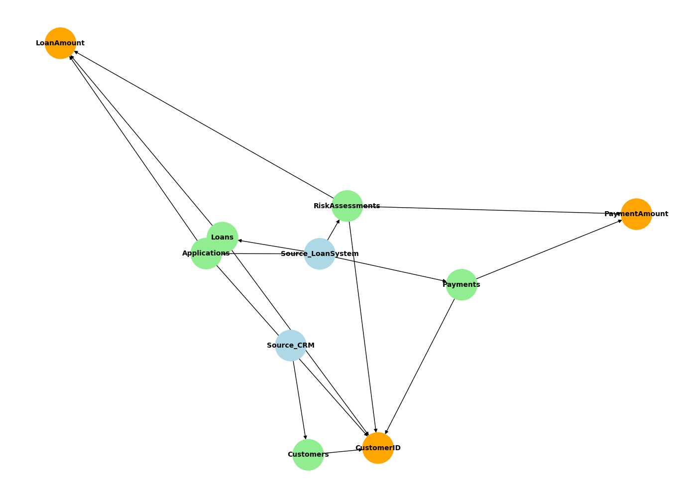

# 🔍 Data Lineage Diagram for Mortgage Lending Schema

This document provides a visual and descriptive overview of how key data elements—such as `CustomerID`, `LoanAmount`, and `PaymentAmount`—flow across the mortgage lending and servicing system. It helps ensure transparency, traceability, and governance across data pipelines.

---

## 📘 Purpose

Data lineage tracks the origin, movement, and transformation of data across systems and tables. This is critical for:
- Regulatory compliance (e.g., GDPR, SOX)
- Impact analysis for schema changes
- Debugging data quality issues
- Building trust in analytics and reporting

---


## 📊 Data Lineage Diagram



## 🧭 Key Data Elements Tracked

| Data Element     | Description                                 |
|------------------|---------------------------------------------|
| `CustomerID`     | Unique identifier for customers             |
| `LoanAmount`     | Requested and approved loan amount          |
| `PaymentAmount`  | Amount paid per transaction                 |

---

## 🗺️ Lineage Flow Summary

### 🔹 Source Systems
- `Source_CRM`: Origin of customer data
- `Source_LoanSystem`: Origin of loan, application, and payment data

### 🔹 Tables Involved
- `Customers`: Stores personal and financial details
- `Applications`: Captures loan requests
- `Loans`: Represents approved loans
- `Payments`: Tracks loan repayments
- `RiskAssessments`: Evaluates creditworthiness and risk

### 🔹 Data Movement
```text
CustomerID:
  Source_CRM → Customers → Applications → Loans → Payments → RiskAssessments

LoanAmount:
  Source_LoanSystem → Applications → Loans → RiskAssessments

PaymentAmount:
  Source_LoanSystem → Payments → RiskAssessments
```
