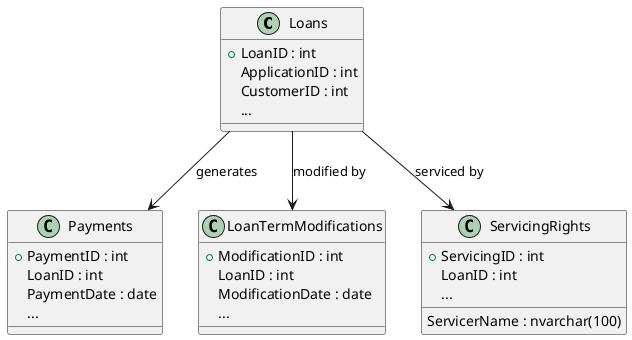
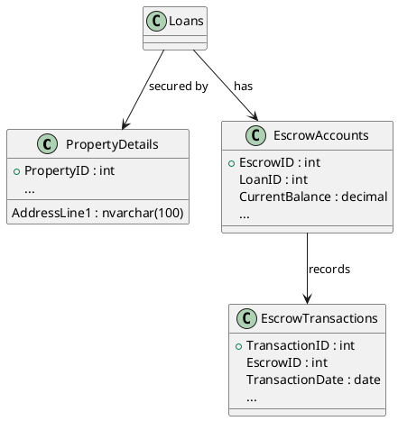
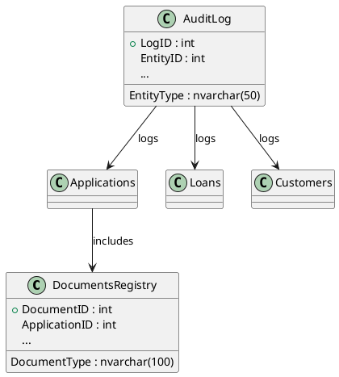
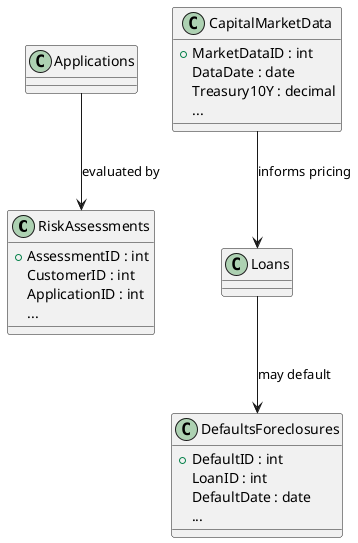
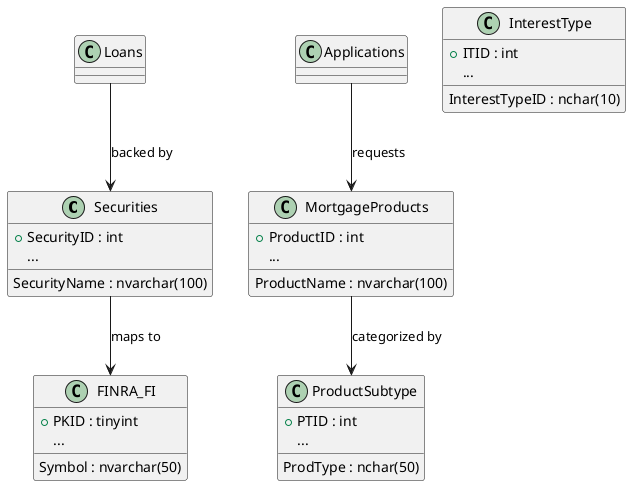

# XYZ Financials UML Diagrams

This repository contains modular PlantUML class diagrams for the XYZ Financials database schema. Each `.puml` file represents a distinct domain, making it easier to visualize relationships and maintain documentation.

![PlantUML diagrams for the XYZ Financials database schema](https://www.plantuml.com/plantuml/png/fLTDRzj64BthL_3M67K0ou4Bn82BwCD215YsO2a1cjkO74k3aBlCpZ2rMkI_bqkDfMMvL57aPhsto_b-i_x00awg8X_mLp8bE2YID0VcaOYZfqfmdbgpehymkHWCVabkRcwIYNMOt1eX8MIF39eRoQHYiGKwJluU9Cclhp_dq-Gw8ICrDYF7SWy5reZv3YxTWdjpTN5MKtVGnwnMzpNO0CEX1wOW-F0y9YVRciX0i0Pl2w0yl3oyQ6uljzPWY5ysyCYO2lAvIMrZCiEK2iZV3A_EBy-QhvMvtHLeP2KW5NUyqXFe8YR_G72iV7Q8VU8m8rcbrc68WM3c0z98X0hKR7mginZvOw3f7fLbJYa8MQCP3v0WwP4wB9tDgbG2vE7vcTBmJFZvY7yMpAYmbP58yZovh5nfELRDddnESijaDe6fjWypRDNfOczgkfu7gDgleolHoUupv1N6_5j_xbvwR9hg6HrcBVAT9zVeYWEf-PcY8SWV4TYQLdzTNPqTY-HpeTNnVyRpUw9OGJWdwtUo87CZw935nnWFxjW7ZZPajEfXAHOWbIFP_GkrHhRvRWcx0jkcBpMjM00PCfinv63IRZaY7Q4ZUikfity-uhUAzdb_eYRsnJo6XS47BQAQemwsdR_7bpYXuCpLTj2akwvlAqmhHs5DuYCRZAj-L9j1VuNts-rnoh5kh9hjfIEJKWbv_4JG2dq7DEkzz1q8pX1xiwqUBb2sDkjE-Tg1OKYrwRlIgTTZBQ6JdI9pdoZglAcMQQRrryzkeV-vNyOEJBeDZ7uaX-rYJcnH43DPqvdB_hauHhgmJZQmGTK2ZRQh38e4KONkAxlUbTsOsyem1iRJGh8W4rjo2tZfAAuUxrSjlNU23wLgXf7ypNcK2dr7LOdZ8AgUJb60SirRH6H7MUQG-OuC3hkP2-dB23qXsSMt7xw-PXellr0viLcxDFiF-B1Tzni7_oCrqyV7kA9S3d6ilbNW_D0UeJ5cpjg2W-BALf536j-T3njpbVyyuz9HLBudbNDef7VP0akzwXmGGzuQW3RLTtyDBoDcP2xwZUXhpX_jqwMF3wCP8iVsGsvjziMQJWc2JCFBV1eJ2o6fij2Xz-U_DOmrcmWLJAyk44BjlyX2UONYawjqNnjCFgtcon1-lny9hl2_zthJVAKryJ6VGOfQYBvcw5lswe6BX5FR8hDf4xqggCspTf25uOHmfrqllFS_Nl-7USHy_tBUKiaU6Hp_UtdxzlVmTUQDRu478TISyUhaIQj2X3oe8ILratb-WmPTcmxgx-K9qg-O9K-xk0tTOFuaCDF6r6V5TizsDi9rqhnWM0BB7VcxJjZxihV_0KrM5Va_)  

## 📦 Modules

### 1. Customer & Application Domain

- Models customer profiles, addresses, and loan applications
- Shows relationships between customers, applications, and assigned loan officers
- Captures applicant metadata, employment, and credit details

  

### 2. Loan & Payment Domain
 
- Represents loan lifecycle, payments, term modifications, and servicing rights
- Highlights financial attributes like interest, escrow, and payment schedules
- Links loans to applications and customers

### 3. Property & Escrow Domain
 
- Details property attributes and escrow account management
- Includes escrow transactions and analysis dates
- Connects loans to collateral properties and escrow flows

### 4. Documents & Audit Domain

- Tracks document registry for applications and audit logs across entities
- Captures approval status, upload metadata, and change history
- Useful for compliance, traceability, and governance

### 5. Risk & Capital Markets Domain

- Models risk assessments, defaults, foreclosures, and capital market data
- Includes credit scoring, DTI, LTV, and macroeconomic indicators
- Links loan performance to external market rates and risk classifications

### 6. Securities & Products Domain

- Represents securities, mortgage products, FINRA data, and product subtypes
- Includes CUSIP, coupon rates, maturity dates, and regulatory flags
- Connects loans to underlying financial instruments and product definitions

## 📜 License
This documentation is provided for internal architecture visualization and planning. No external redistribution without permission.
