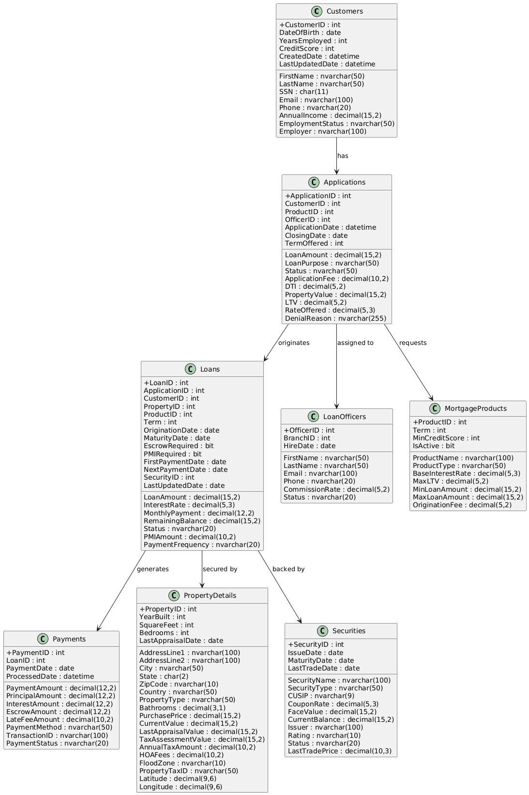

# XYZ Financials UML Diagrams

This repository contains modular PlantUML class diagrams for the XYZ Financials database schema. Each `.puml` file represents a distinct domain, making it easier to visualize relationships and maintain documentation.

  

## 📦 Modules

### 1. Customer & Application Domain

- Models customer profiles, addresses, and loan applications
- Shows relationships between customers, applications, and assigned loan officers
- Captures applicant metadata, employment, and credit details

  

### 2. Loan & Payment Domain
 
- Represents loan lifecycle, payments, term modifications, and servicing rights
- Highlights financial attributes like interest, escrow, and payment schedules
- Links loans to applications and customers

### 3. Property & Escrow Domain
 
- Details property attributes and escrow account management
- Includes escrow transactions and analysis dates
- Connects loans to collateral properties and escrow flows

### 4. Documents & Audit Domain

- Tracks document registry for applications and audit logs across entities
- Captures approval status, upload metadata, and change history
- Useful for compliance, traceability, and governance

### 5. Risk & Capital Markets Domain

- Models risk assessments, defaults, foreclosures, and capital market data
- Includes credit scoring, DTI, LTV, and macroeconomic indicators
- Links loan performance to external market rates and risk classifications

### 6. Securities & Products Domain

- Represents securities, mortgage products, FINRA data, and product subtypes
- Includes CUSIP, coupon rates, maturity dates, and regulatory flags
- Connects loans to underlying financial instruments and product definitions

## 📜 License
This documentation is provided for internal architecture visualization and planning. No external redistribution without permission.
