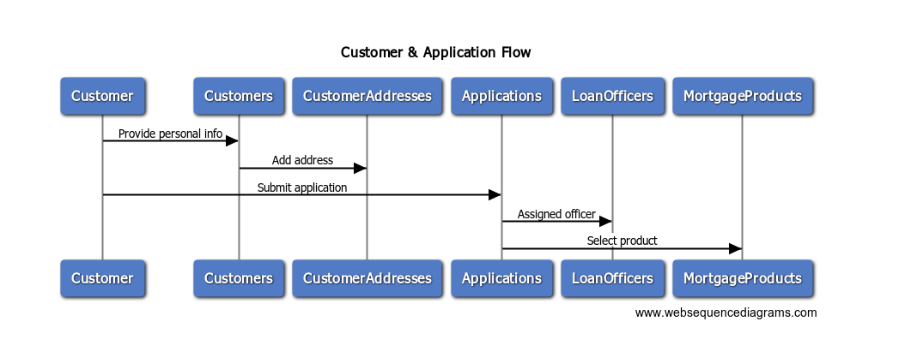
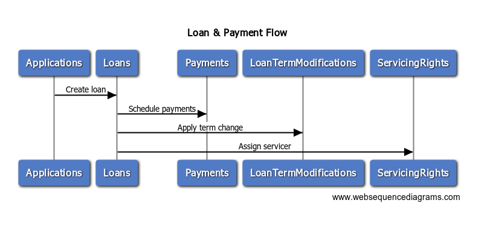
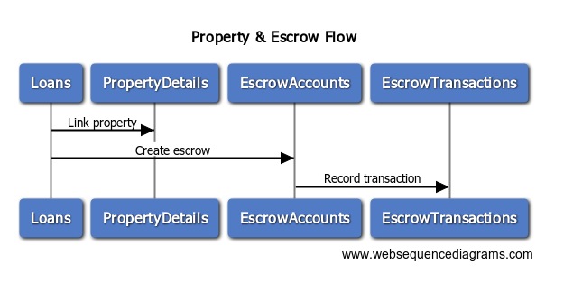
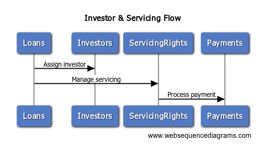
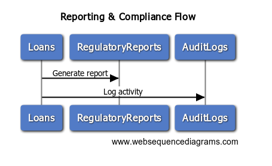
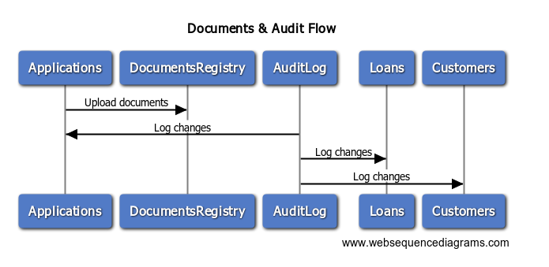
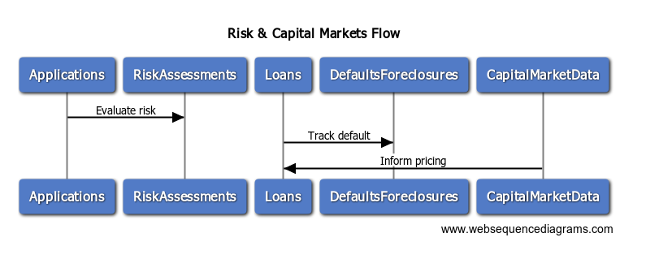
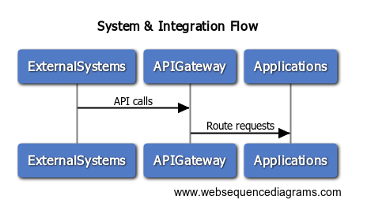
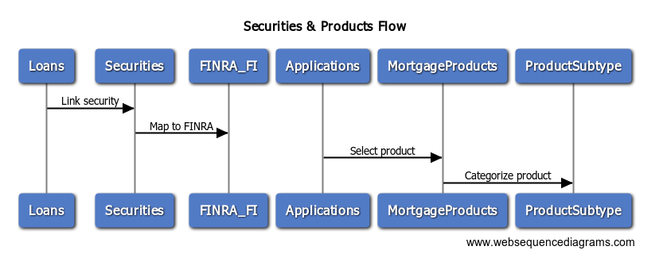

# 🔁 XYZ Financials – WebSequenceDiagrams

This repository contains WebSequenceDiagrams (WSD) for the XYZ Financials database schema. Each `.wsd` file models interactions between entities in either a full schema or modular domain view.

<a href="All-In-One.wsd">All-In-One.wsd</a>  

## 🧩 Modular Diagrams

### 🔵 Customer & Application Domain

  

###  🟢 Loan & Payment Domain

  

### 🟠 Property & Collateral Domain

  

### 🟣 Investor & Servicing Domain

  

### 🟡 Reporting & Compliance Domain

  

### 🟠 Documents & Audit Domain

  

### 🟡 Risk & Capital Markets Domain

  

### 🟣 System & Integration Domain

  

### 🟢 Reporting & Compliance Domain

### Securities & Products Domain

  

