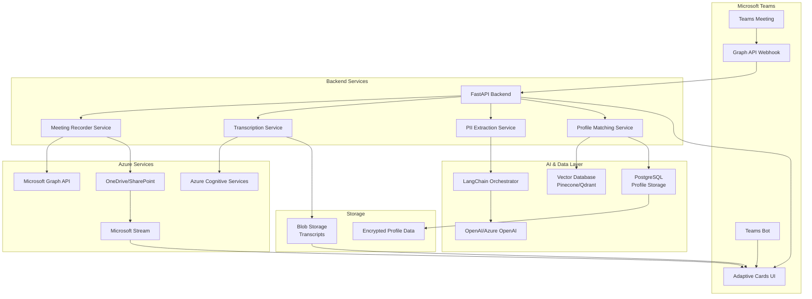

# Microsoft Teams Meeting Intelligence Integration

## 🚀 Overview

A comprehensive Microsoft Teams integration that automatically records meetings, transcribes conversations, extracts participant information, and creates intelligent user profiles using AI-powered matching and vector databases.

## 🏗️ Architecture Diagram



## 🎯 Features

### 🎙️ Meeting Recording & Transcription
- Automatic recording of scheduled and ad-hoc Teams meetings
- Real-time speech-to-text conversion with speaker attribution
- Timestamp-synchronized transcripts

### 📹 Video Storage & Sharing
- Secure video storage via Microsoft Stream
- One-click shareable links in Teams chat
- Post-meeting summary with video and transcript access

### 🔐 PII Capture & Profile Matching
- Intelligent extraction of participant information
- AI-powered profile matching and deduplication
- Vector-based similarity scoring for fuzzy matching

### 🧠 AI Database & Matching Logic
- Semantic search across user profiles
- Automated profile enrichment and validation
- Privacy-preserving data handling

## 🛠️ Tech Stack

- **Backend**: Python (FastAPI), Node.js
- **Frontend**: Teams Bot Framework, Adaptive Cards
- **Cloud**: Azure (primary), AWS (optional)
- **Database**: Vector DB (Pinecone/Qdrant) + PostgreSQL
- **APIs**: Microsoft Graph, Azure Cognitive Services

## 🚀 Quick Start

### Prerequisites

```bash
# Required accounts and services
- Microsoft 365 Developer Account
- Azure Subscription
- Pinecone/Qdrant Account
- OpenAI API Key (or Azure OpenAI)
```

### Installation

```bash
pip install -r requirements.txt
npm install
```

### Environment Configuration

```bash
# .env file
```

## 📋 Code Snippets

### Microsoft Graph API - Meeting Recording

```python
```

### Azure Speech-to-Text Transcription

```python
```

### Vector Database Profile Matching

```python
```

### Video Storage & Sharing

```python
```

## 🔒 Security & Compliance

### Data Protection Measures

```python
# Encryption configuration

# GDPR Compliance

# Access Control
```

### Compliance Checklist

- ✅ **GDPR**: Right to access, portability, erasure, anonymization
- ✅ **HIPAA**: Business Associate Agreement, encryption, audit logging
- ✅ **SOC 2**: Access controls, data encryption, monitoring
- ✅ **Microsoft 365 Compliance**: Leverages existing M365 security controls

## 🚀 Deployment Strategy

### Azure Resources Required

```yaml
# azure-resources.yml
```

### Teams App Manifest

```json
# teams-app-manifest.json

```

### Docker Deployment

```dockerfile
# Dockerfile
# Install system dependencies
# Install Python dependencies
# Copy application code
# Expose port
# Health check
# Run application
```

## 📊 Monitoring & Analytics

```python
# Application Insights integration
# Custom metrics

```


**⚠️ Important**: Ensure compliance with your organization's data governance policies and obtain necessary permissions before deploying in production environments.

